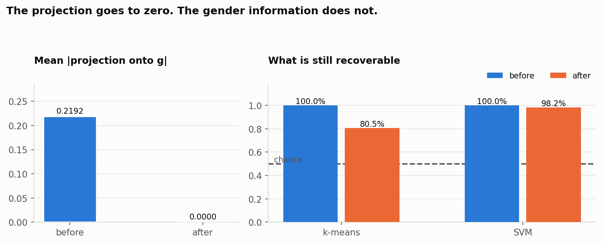
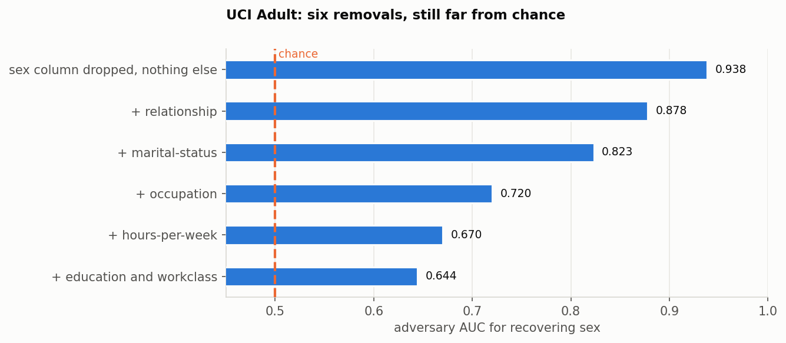
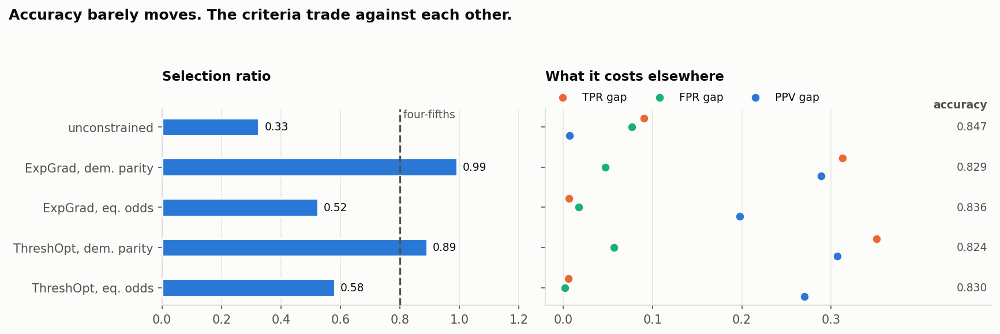

# EU AI Act Article 10 - HR bias testing

A worked notebook on what Article 10 actually asks of an HR system, and how to
test for it. HR screening is Annex III high risk, so Article 10 applies in full.

The Article 10 notebook at the repo root runs entirely on synthetic data - no
real candidates, no PII. The seven notebooks in `notebooks/` are a separate
strand and several of them use real public benchmarks; see that section.

## What it covers

| Section | Article | What it does |
|---|---|---|
| 1. Data provenance | 10(2)(a) | Records where the data came from and how it was governed |
| 2. Demographic parity | 10(2)(f), 10(3) | Hire rates per group, disparate impact ratio, four-fifths rule |
| 3. Special category data | Art 4a | Drafts and completeness-checks the Article 4a justification |
| 4. Synthetic data | 10(3) | Generates PII-free test data with deliberately injected bias |
| 5. Checklist | - | Rolls the five checks into a pass/warn/fail verdict |

## The point: validate the test, not just the data

Everything here is generated, so the true bias per group is known. That is the
whole reason for synthetic data. On real data you can measure a disparity but
you can never check whether your test was right, because nobody knows the
answer.

Run that check and the four-fifths rule does badly. The comparison has to be made
carefully: "a penalty was injected" is not the same as "the rule should have
flagged it", since a small penalty does not put a group under 0.80. `DIR pop` is
the ratio the generator implies in the population, measured at 400,000 rows. A
group is a genuine miss only if its population DIR is below 0.80.

```
attribute  group           n   rate  DIR obs  DIR pop  flagged verdict
gender     Non-binary     19  31.6%     0.74     0.71  YES     true positive
gender     Woman         242  33.5%     0.78     0.83  YES     FALSE POSITIVE
age_group  46-60         105  39.0%     1.00     0.87  no      true negative
age_group  60+            19  26.3%     0.67     0.61  YES     true positive
ethnicity  Black          54  38.9%     0.97     0.74  no      FALSE NEGATIVE
ethnicity  Hispanic       55  27.3%     0.68     0.84  YES     FALSE POSITIVE
ethnicity  Other          29  31.0%     0.78     1.00  YES     FALSE POSITIVE

12 groups: 2 true positive, 6 true negative, 1 FALSE NEGATIVE, 3 FALSE POSITIVE
The four-fifths rule got 4 of 12 groups wrong at n=500.
```

**Black is the only real violation in the file** - population DIR 0.74 - and the
test read 0.97 and cleared it. Meanwhile Woman, Hispanic and `Other` were all
flagged despite population DIRs of 0.83, 0.84 and 1.00. At n=500 the rule
produces three false alarms and misses the one group that was genuinely
discriminated against.

### It is worse than four wrong answers

Put a bootstrap interval on each ratio and **not one of the twelve groups can be
classified**. Every interval crosses 0.80:

```
gender     Non-binary     19   0.74   [0.26, 1.00]   CANNOT TELL
ethnicity  Black          54   0.97   [0.58, 1.00]   CANNOT TELL
ethnicity  Hispanic       55   0.68   [0.35, 0.95]   CANNOT TELL
```

So the rule did not get four of twelve wrong. It never had the information to get
any of them right, and the verdict it printed was a coin toss with a decimal
point. Simulate the rule directly and the size it needs is visible:

```
 n per group    detects DIR 0.74    false alarm at DIR 1.00
          20                 55%                        27%
         100                 66%                        10%
         500                 81%                         0%
```

Roughly **500 per group** before a real 0.74 disparity is detected more often
than not, and the false-alarm rate only falls below 5% somewhere past 200. Most
HR datasets do not have 500 people in the groups that matter.

Two more checks in the same section. The conditional DIR for `Woman` runs from
**0.51** among high-school candidates to **0.84** among bachelor's - one stratum
fails badly, another passes comfortably, mostly from splitting 500 people four
ways. And the intersectional table has **15 cells, one empty and four with fewer
than ten candidates**, which is the real answer to "why does nobody test
intersections".

Section 4 repeats the failure independently on a separate 400-row set: three
injected biases all recovered, plus `Group_D` flagged at DIR 0.78 with nothing
injected.

So the headline is not "here is how to run a bias test". It is that a
compliance test you have not validated can clear a group that really was
discriminated against, and the report will look clean.

## notebooks/

Eight notebooks that test the standard bias-mitigation moves rather than
describing them. Each one states a claim, runs it, and reports what happened.
All outputs are committed, so they read without being run.

| | Claim under test | Result |
|---|---|---|
| **01** proxy detection | Dropping the protected attribute and its proxies makes a model blind to it | Adversary recovers gender at **0.888**. Stripping postcode and school - real proxies here - takes it to **0.830**, not to chance. Six of eight features gone before it reaches 0.589 |
| **02** label choice | Bias-aware training fixes prejudiced historical labels | Held out, 12 seeds: DIR **0.35 vs 0.72**, unanimous, accuracy gap only **0.012**. But reweighing the *wrong* label reaches the same point (0.73 at 0.647) and an in-training parity penalty beats it (**0.668 at 0.87**, ceiling 0.672), so the honest claim is narrower: label choice is the only move needing **no access to the protected attribute**. All three mitigation families in one table |
| **03** impossibility | A pipeline can output "compliant" data | Group-blind and calibrated fails four-fifths at **0.68**. Forcing parity to 1.00 opens a **0.099 PPV gap** and needs different thresholds per group |
| **04** lipstick on a pig | Projecting out the gender direction debiases embeddings | Projection falls to **0.0000**. On Gonen & Goldberg's own protocol an SVM still recovers gender at **93.2%**, above their 88.88%. On words of *middling* association it gets **58.2%**, so the residue is concentrated in the extremes |
| **05** linear vs adversarial | Proxies can be removed | Linear probe hits chance three ways; tree probe stays at **0.98**. With the paper's stopping rule INLP needs **one** projection on 8 seeds of 8, leaves rank 11 of 12, and changes nothing. A linear probe on squared terms gets **0.83**, so "no direction to remove" is basis-dependent |
| **06** COMPAS | The recidivism fight had a right answer | Calibrated for both races **and** false positive rate 42.3% vs 22.0%. Both sides correct. Equalising one breaks the others, drawn as two group ROC curves with each rule marked on them |
| **07** the same test on real data | Notebook 1's result depends on a generator I wrote | UCI Adult: **0.938**, still **0.644** after six removals. **ACSIncome** (the dataset that replaced Adult): 0.814 down to **0.534**, so the effect is real but smaller on modern data. German Credit: sex hides inside `personal_status`, **0.699 ± 0.036**. LSAC: **LSAT alone recovers race at 0.716**. And an income model never shown `sex` is calibrated within both sexes at base rates of 31% and 12% |
| **08** constrained learning | Pick a criterion, hand it to a library, done | On Adult with `fairlearn`: accuracy moves **at most 0.023**. Enforcing demographic parity takes the selection ratio 0.33 to **0.99** and the PPV gap 0.007 to **0.289**. Enforcing equalised odds closes both error gaps to **≤0.017** and leaves the selection ratio at **0.52**, still a four-fifths failure |



*Notebook 4. Hard-debiasing drives the projection onto the gender direction to
exactly zero, which is the metric the method optimises. An SVM still recovers
gender at 98.2%.*



*Notebook 7. Real census data. Six successive feature removals, and the
adversary is still far from chance. The largest single drop comes from
`relationship`, because that column contains "Husband" and "Wife".*

Notebooks 1, 2, 3 and 5 use synthetic data, because they need ground truth: you
cannot score a bias test against the bias that was injected unless you injected
it. Notebooks 4, 6 and 7 use real data - GloVe 300d, the ProPublica COMPAS file,
and UCI Adult, German Credit and LSAC law school admissions - so the results do not rest on a generator I
wrote. Notebook 7 exists specifically to re-run notebook 1's test on data I did
not construct, and the effect is larger there.

The three mitigation families are all represented rather than described:
**pre-processing** (drop columns in 01 and 07, project in 04 and 05, reweigh in
02), **in-training** (a parity penalty in 02, `fairlearn`'s
`ExponentiatedGradient` in 08), and **post-processing** (per-group thresholds in
02, 03, 06, 08 and the root notebook). Notebook 8 runs the last two head to head
on the same split and prices them.



*Notebook 8. Five arms, one held-out split. The accuracy column barely moves. The
selection ratio and the three error gaps move a great deal, and never in the same
direction.*

The sources are in `papers/`, 13 open-access PDFs with a README mapping each
claim to the paper behind it. Barocas, Hardt & Narayanan's textbook is among
them; Chapter 3 is the one these notebooks are a companion to.

## Other results

Two experiments in Section 2 are not rate comparisons at all.

A **name-flip audit** - the Bertrand & Mullainathan design, run against the model
rather than against employers. Same CV, one field changed. Women given a male
first name move from **0.339 to 0.403** mean score, against a same-pool placebo
shift of +0.005. The screener was never given gender.

A **six-round feedback loop** in notebook 2, where each round only observes the
outcomes of the applicants it accepted. The selection ratio drifts **0.71 to
0.62** while the audit AUC *improves* **0.623 to 0.665**. The metric an ML team
watches goes up in every round in which the disparity gets worse.

Mitigation under 10(2)(g) is post-processing with per-group thresholds:

```
Overall hire rate  original 37.8%  ->  corrected 38.6%
  newly hired 90    no longer hired 86
  Man 42.7% -> 38.9%    Woman 33.5% -> 38.4%    Non-binary 31.6% -> 36.8%
```

An earlier version multiplied the observed label by a weight, which gave every
rejected candidate p=0. It could only un-hire people, so it reached parity by
levelling down and dropped the overall rate to 32.0%. That is kept in the
notebook as a documented failure rather than deleted.

The thresholds are set on **gender only**, so the corrected rule cannot see age
or ethnicity and their population rates are equal by construction. The checklist
still reports `B1 FAIL` - on `age_group:18-30` at DIR **0.7997**, four
ten-thousandths under the line - and over 200 seeds it fails **97.5%** of the
time, flagging an ethnicity group in **85.5%** and `Black` in **37%**. Every one
of those is noise from group sizes of 19 to 54.

Final checklist: **2 PASS, 2 WARN, 1 FAIL**, and the FAIL is not a finding. That
is the second half of the same lesson: in Section 2 the rule cleared a group that
really was discriminated against, and here it condemns groups that provably were
not.

## Limits

- The root notebook uses synthetic data throughout. Its numbers demonstrate the
  method and say nothing about any real hiring process. `notebooks/` is mixed;
  each one states which it uses.
- The four-fifths rule is a US EEOC convention. It is a useful screen under
  Article 10(2)(f) but it is not what the AI Act specifies, and it is not a
  legal test on its own. As the results above show, at these group sizes it
  also misses real bias.
- Group sizes here are small. `Non-binary` and `60+` are 19 people each, `Other`
  is 29. A rate on 19 people is noise, and the bootstrap intervals above put a
  number on how much: [0.26, 1.00] for `Non-binary`. That is a property of the
  demo, but it is also what a real HR dataset looks like for the groups that
  matter most, and the power table says what size would be enough.
- The provenance records in Section 1 describe fictional sources. The files
  exist and the SHA-256 hashes are of those files, but "Workday, tenant:
  acme-corp" and the rest are invented. Replace them before the report means
  anything.
- The Article 4a justification is a drafting aid with a completeness check.
  It is not legal advice and it does not decide whether the exception applies.
- Correcting a disparity in the data does not make the system compliant. It is
  one of several obligations.
- The name-flip audit in Section 2 is run against a model fitted on 500 rows.
  Its placebo arm flips 106 of 500 decisions on its own, so read the group means
  and not the flip counts. The gender effect clears that floor (+0.064 against
  +0.005); the surname effect does not (+0.008) and is not reported as one.

## Running it

Open `eu_ai_act_article10_hr_compliance.ipynb`. Needs numpy, pandas and
matplotlib and scikit-learn. The notebooks in `notebooks/` additionally use
gensim (04), fairlearn (08) and folktables (07); everything else is stdlib. Run all cells; every number in this README is
reproduced exactly, because every generator is seeded.

To point it at real data, replace `generate_synthetic_resumes()` with an ATS
export and rewrite the Section 1 provenance records. Read the limits first.

`data/` holds the three CSVs the Section 1 provenance records name, written by
the notebook and hashed by it. They are synthetic: `SYN-` ids, invented names.

Outputs already in the repo: `article10_compliance_report.html`,
`article_10_5_justification.json`, and the two hire-rate charts.
